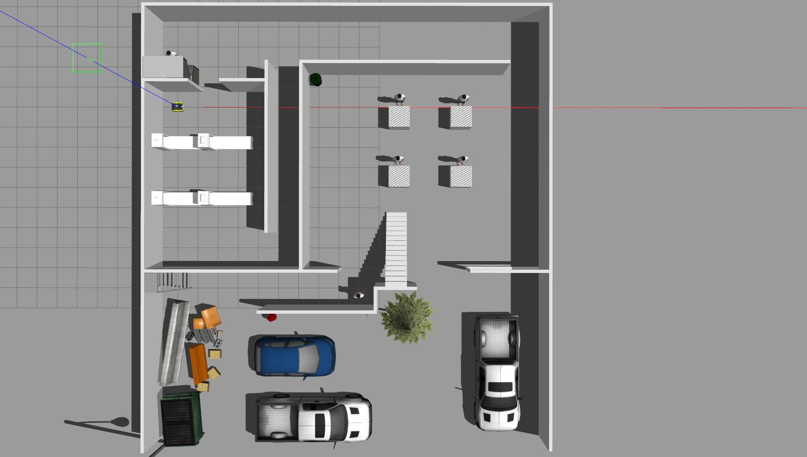
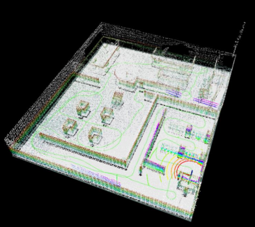

# ME5413_Final_Project

NUS ME5413 Autonomous Mobile Robotics Final Project
> Authors: Hridik Kajaria, Atharva Madkaikar, Xie Linji, Guo Ziyi




## Dependencies

* System Requirements:
  * Ubuntu 20.04 (18.04 not yet tested)
  * ROS Noetic (Melodic not yet tested)
  * C++11 and above
  * CMake: 3.0.2 and above
* This repo depends on the following standard ROS pkgs:
  * `roscpp`
  * `rospy`
  * `rviz`
  * `std_msgs`
  * `nav_msgs`
  * `geometry_msgs`
  * `visualization_msgs`
  * `tf2`
  * `tf2_ros`
  * `tf2_geometry_msgs`
  * `pluginlib`
  * `map_server`
  * `gazebo_ros`
  * `jsk_rviz_plugins`
  * `jackal_gazebo`
  * `jackal_navigation`
  * `velodyne_simulator`
  * `teleop_twist_keyboard`
  * `A-Loam`[A-LOAM](https://github.com/HKUST-Aerial-Robotics/A-LOAM)
  * `Hector-SLAM`[Hector SLAM](https://github.com/samialperen/oko_slam/blob/master/doc/hector_slam_tutorial.md)
* And this [gazebo_model](https://github.com/osrf/gazebo_models) repositiory

## Installation

This repository is a ROS workspace, containing 4 ros packages:
* `interactive tools`
* `jackal_description`
* `me5413_world`
* `octomap_server`

**Note:** Octomap server ROS package can be installed seperately. Please refer to ROS wiki.
[Octomap Server Doc](https://wiki.ros.org/octomap_server)

Clone this repository on your local machine:

```bash
# Clone the repository
cd
git clone https://github.com/madkaikaratharva/ME5413_Final_Project_Group_17.git
cd ME5413_Final_Project_Group_17

# Install all the dependencies
rosdep install --from-paths src --ignore-src -r -y

# Build the workspace
catkin_make

# Source this directory everytime you launch a new terminal
source devel/setup.bash
```

This project uses a custom gazebo world. You will need to download the necessary models in the `~/.gazebo/models/` directory.

```bash
# Official Gazebo Model
cd
mkdir -p .gazebo/models
git clone https://github.com/osrf/gazebo_models.git
cp -r ~/gazebo_models/* ~/.gazebo/models

# Custom Model
cp -r ~/ME5413_Final_Project/src/me5413_world/models/* ~/.gazebo/models
```


## Usage

### 0. Gazebo World

Use this command to launch the Gazebo World Model.

```bash
# Launch Gazebo World together with our robot
roslaunch me5413_world world.launch
```

A keyboard teleop controller has been provided to manually control the robot to move around in the world.
```bash
# Launch the teleop controller
roslaunch me5413_world manual.launch
```


### 1. Mapping

A-LOAM algorithm was used to build map in this project. Please refer to the official documentation of A-LOAM to install it on your local machine.
[A-LOAM documentation](https://github.com/HKUST-Aerial-Robotics/A-LOAM)

A-LOAM generates a 3D map in the form of a point cloud. To convert this 3D point cloud into a 2D grid map, we used the Octomap Server.

Sample terminal commands have been provided to launch `A-LOAM` and `Octomapping` nodes.


```bash
# Launch Octamapping Node
roslaunch octomap_server octomap_server.launch

# Launch A-LOAM
roslaunch aloam_roslaunch aloam_velodyne aloam_velodyne_VLP_16.launch

```
Make sure that appropriate changes are made in the `aloam_velodyne_VLP_16.launch` and `octomap_server.launch` launch files.

**Note:** After launching A-LOAM, add the following topics in rviz:
* Map topic: /projected_map
* OccupyGrid topic: /octomap_full
* OccupyMap topic: /octomap_binary

To generate the occupancy grid map, move the robot around in the world using the provided teleop keyboard controller. Once a satisfactory result is obtained, run the following command to save the map:

```bash
# Save the map as `my_map` in the `maps/` folder
roscd me5413_world/maps/
rosrun map_server map_saver -f your_map_name map:=/map
```

**Note:** Parameters of our custom map are saved in map_improved_1.pgm and map_improved_1.yaml file.




**Figure:** A-LOAM and Octomapping server running simultaneously 


**Figure:** Final grid map output


### 2. Navigation

After completion of mapping process, relaunch the gazebo world to reset the robot to it's default position.

For this project, Adaptive Monte Carlo (AMCL) particle filter was used for localization. A* algorithm was used for global path planning and Dynamic Window Approach (DWA) was used for local planning. To load the navigation stack, run the following:

```bash
# Launch localizer and planner
roslaunch me5413_world navigation.launch
```
## License

The [ME5413_Final_Project](https://github.com/NUS-Advanced-Robotics-Centre/ME5413_Final_Project) is released under the [MIT License](https://github.com/NUS-Advanced-Robotics-Centre/ME5413_Final_Project/blob/main/LICENSE)